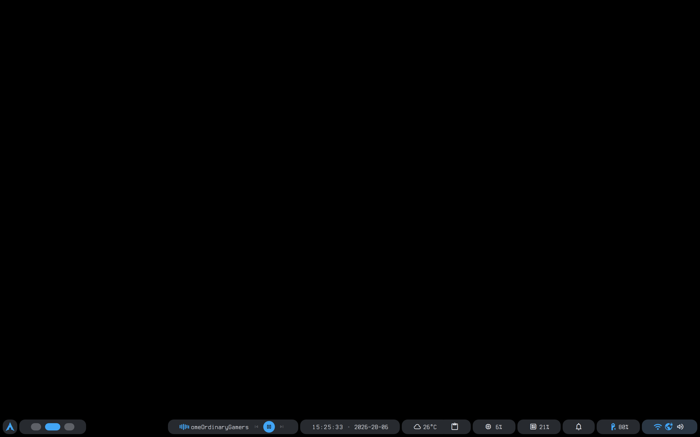

# my dotfiles

This is my personal config for my arch + hyprland setup.

## features

started running a search engine locally with searXNG.

the 'autopush' script runs on a systemd timer to push updates every 30s, making sure local changes also reflect in this repo.

## my stack

- arch linux (OS)
- hyprland (WM)
- KDE Plasma (fallback DE)
- fish shell
- swaybg (for wallpaper)
- swaylock lockscreen
- kitty terminal
- rofi app launcher
- searXNG search engine
- nvim IDE with lazyvim config
- caelestia shell
- no unnecessary bloat

## installing it
- install the apps with your package manager, for example with arch you would type 'yay -S hyprland kitty fish rofi plasma-desktop caelestia-shell'
- clone this repo and copy the 'config' folder to ~/.config
- to install searXNG, install it with docker, and then see services/searXNG for config details.

## what it looks like:

plain and simple, like it should be.
